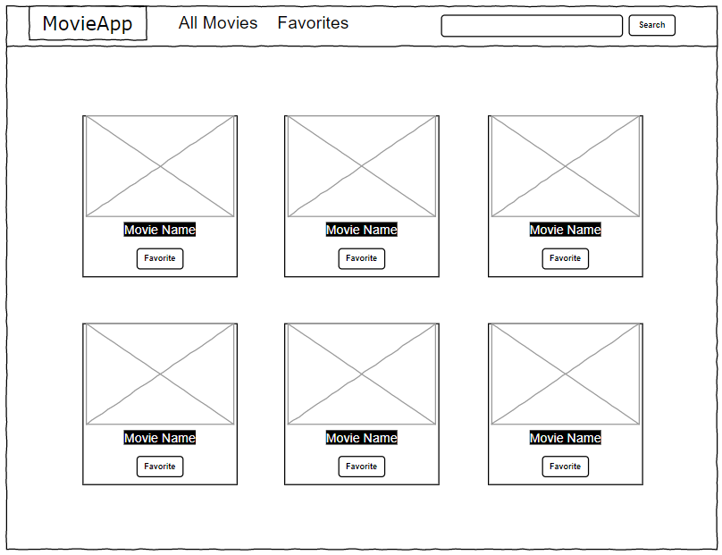
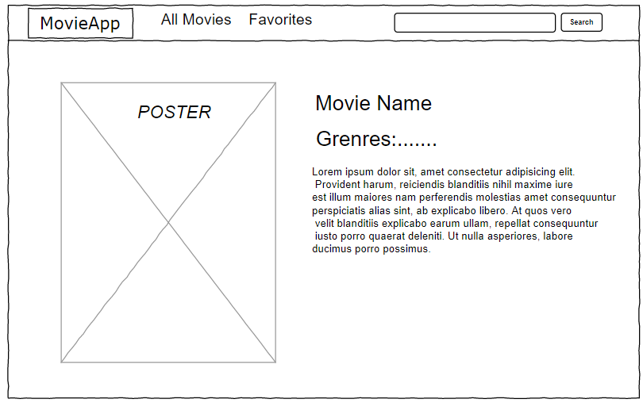

## Live Link: [here](https://mhmdrashed.github.io/Project_MovieApp_React/)

## Technologies Used: 

- ReactJS
- Redux
- Bootstrap

## User Stories:

- As a user, I can see the latest movies.
- As a user, I can search movies.
- As a user, I can add a movie or remove it from my favorites.
- As a user, I can see movie details (Movie Name, Poster, Movie Description, Genres)
- As a user, I can see similar movies for each movie.

## Wireframes:

 

## Developers: 

<ul>

<li> 

### [Nada Al-Otaibi](https://github.com/NadaAlOtaibi) </li>
<li> 

### [Reham Alanazi](https://github.com/unzreham) </li>
<li> 

### [Abdulmajeed Almaymuni](https://github.com/Abdulmajeed-Almaymuni) </li>
<li> 

### [Mohammed Albalawi](https://github.com/MhmdRashed) </li>

</ul>
